# 网络NGO

- 服务端权威是指游戏的逻辑和状态都由服务端来控制和同步，客户端只负责接收服务端的数据并展示给用户，或者向服务端发送用户的操作请求。这种模式的优点是可以保证游戏的数据一致性和安全性，防止客户端作弊或篡改数据，适用于对精确性和反作弊要求较高的游戏，比如射击类、竞技类、策略类等。缺点是会增加服务端的压力和成本，以及网络延迟和丢包的影响。
- 客户端权威是指游戏的逻辑和状态都由客户端来控制和同步，服务端只负责转发客户端的数据或提供一些辅助功能。这种模式的优点是可以减少服务端的压力和成本，以及网络延迟和丢包的影响，适用于对网络延迟、运维成本和复杂性要求较低的游戏，比如合作类、休闲类、冒险类等。缺点是会降低游戏的数据一致性和安全性，容易出现客户端作弊或篡改数据的情况。


### NetworkObject

NetworkObjectId：两个客户端各自生成1个玩家，两个端都是玩家一id=1，玩家二id=2

可以在所有端中找到同一个副本（玩家一在机器1生成控制的，但在其他机器上也有玩家一的副本，通过id可以在所有机找到玩家一本身及其副本）


网络通信就是 同NetworkObjectId的网络组件通信 或 同NetworkObjectId的网络组件同属性字段同步


RPC找到对应NetworkObjectId的对应NtworkBehaviour ID对象，执行RPC方法


### NetworkBehaviour

继承这个类，可以使用各种关于网络的属性和方法


电脑1的P1和P2：

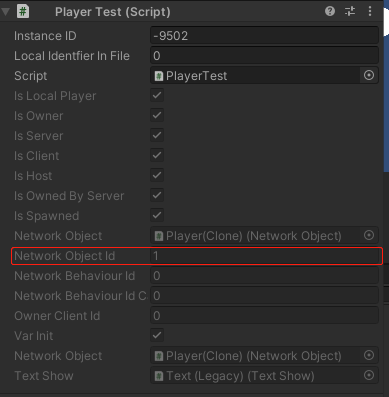 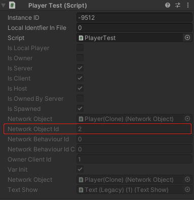 

电脑2的P1和P2：

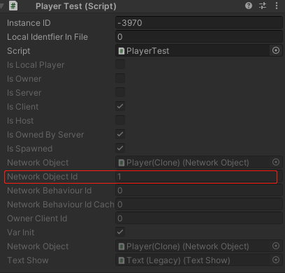 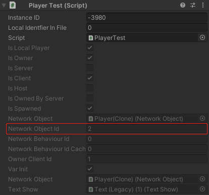 


- **isOwner**：当前实例是否属于当前客户端

  如电脑1的P1的IsOwner=true，电脑2的P2的IsOwner=true

  每个 `NetworkObject` 都有一个所有者。所有者通常是创建该对象的客户端。例如，当客户端创建一个新的玩家对象并将其同步到服务器和其他客户端时，该客户端就成为该玩家对象的所有者。

  

  玩家类移动，当前播放器控制当前玩家的移动（玩家1播放器控制玩家1移动，玩家2播放器执行玩家1的Update方法时会返回）

  ```csharp
  private void Update() {
      // 只在本地播放器中执行Update
      if (!IsOwner) return;
  
      HandleMovement();
      HandleInteractions();
  }
  ```

  

- NetworkBehaviour.IsServer：当前实例是否运行在Server端（与NetworkManager.Singleton.IsServer的值相同）

  如Host端的P1和P2的IsServer=true，Client端的的P1和P2的IsServer=false

  （IsClient同理：是否运行在Client端）

  

- NetworkObject.Despawn() ：从所有客户端中销毁当前游戏对象，但在服务器中该对象还存在在内存中（但从场景中移除，要彻底删除传入参数true）


### NetworkTransform

让两端同步某个游戏对象的Transform，这样两边运动对方才能看到

为Server权限，由服务器检测Transform更改，并推送到客户端。

Server端控制移动，游戏中对象才会移动，Client端无法使其对象移动

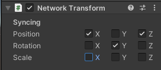 

### ClientNetworkTransform

让客户端将Transform的变化推送出去，所有客户端控制自身的Transform

```csharp
using Unity.Netcode.Components;
using UnityEngine;

namespace Unity.Multiplayer.Samples.Utilities.ClientAuthority
{
    [DisallowMultipleComponent]
    public class ClientNetworkTransform : NetworkTransform
    {
        protected override bool OnIsServerAuthoritative()
        {
            return false;
        }
    }
}
```


### NetworkAnimator

将当前网络对象的动画同步到其他端，加上这个玩家能看到其他玩家的动画

默认为服务器权威

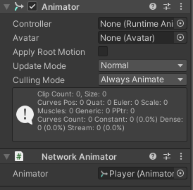 

改成所有者权威：

### OwnerNetworkAnimator

```csharp
public class OwnerNetworkAnimator : NetworkAnimator
{
    protected override bool OnIsServerAuthoritative()
    {
        return false;
    }
}
```

并且在设置动画参数的时候，仅由所有者设置本身的参数（不然可能当B触发动画时，A的播放器中的B没触发动画，所以A中会设置B是没触发动画的状态，会影响到B）客户端对不属于自己的对象进行操作或更新，会造成数据不一致或者冲突的问题

```csharp
private void Update() {
    // 只在所有者的播放器执行
    if (!IsOwner) return;

    animator.SetBool(IS_WALKING, player.IsWalking());
}
```


NetworkObject

父对象里面有了，子对象就可以不用加


### RPC

**RPC发给同一个NetworkObject在不同机上的克隆实例**，对于同一个NetworkObject的克隆实例，ClientRPC是Server端发给Client端，ServerRPC是Client端发给Server端

#### ClientRPC

```csharp
public class RPCTest : NetworkBehaviour
{
    private void Update()
    {

        if (Input.GetKeyDown(KeyCode.A))
        {
            Debug.Log($"服务端发送 id:{NetworkObjectId}");
            PongClientRPC("hello");
        }
    }
    
    [ClientRpc]
    private void PongClientRPC(string text)
    {
        Debug.Log($"客户端收到 id:{NetworkObjectId} text:{text}");
    }

}
```

**Host玩家n**发给**Host端和Client端玩家n**

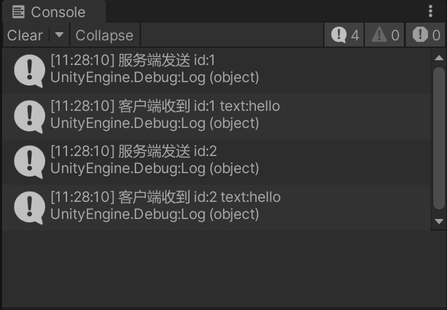 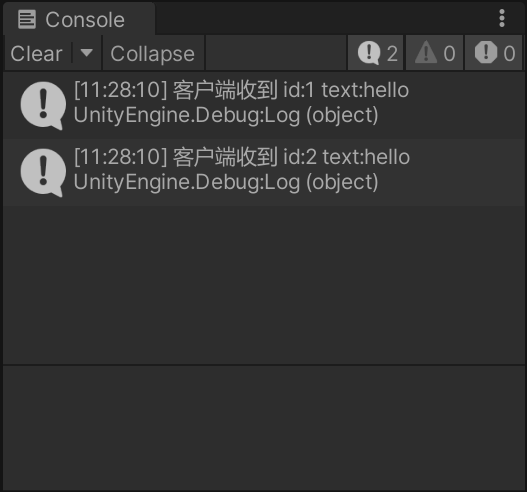 

Client端发送不了ClientRPC

 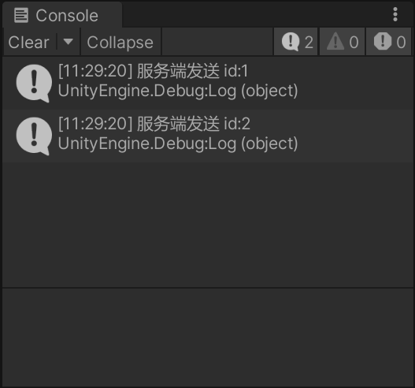 


#### ServerRPC

```csharp
public class RPCTest : NetworkBehaviour
{
    private void Update()
    {

        if (Input.GetKeyDown(KeyCode.A))
        {
            Debug.Log($"客户端发送 objId:{NetworkObjectId}");
            MyGlobalServerRpc();
        }
    }
    
    [ServerRpc(RequireOwnership = false)]
    public void MyGlobalServerRpc(ServerRpcParams serverRpcParams = default)
    {
        var clientId = serverRpcParams.Receive.SenderClientId;
        Debug.Log($"服务端收到 objId:{NetworkObjectId} 发送方clientId:{clientId}");
        if (NetworkManager.ConnectedClients.ContainsKey(clientId))
        {
            var client = NetworkManager.ConnectedClients[clientId];
        }
    }
}
```

**Host端玩家n**发给**Host端玩家n**

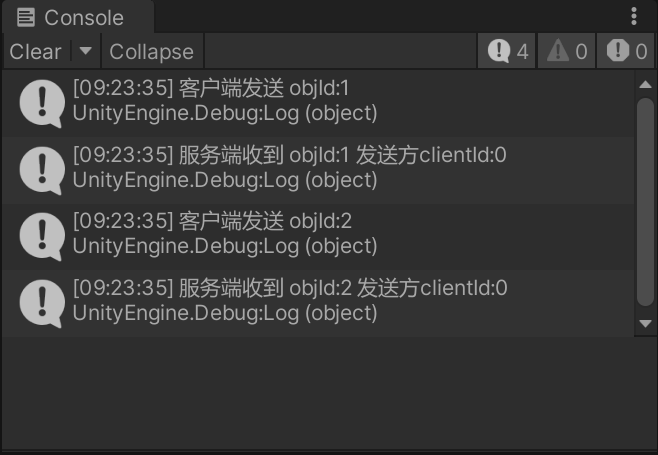 

**Client端玩家n**发给**Host端玩家n**

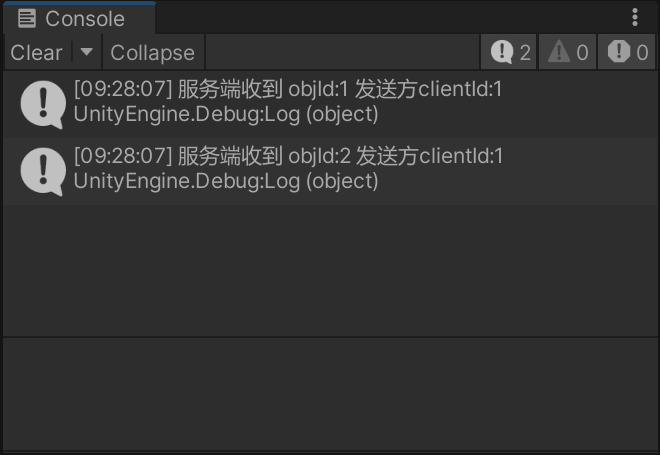 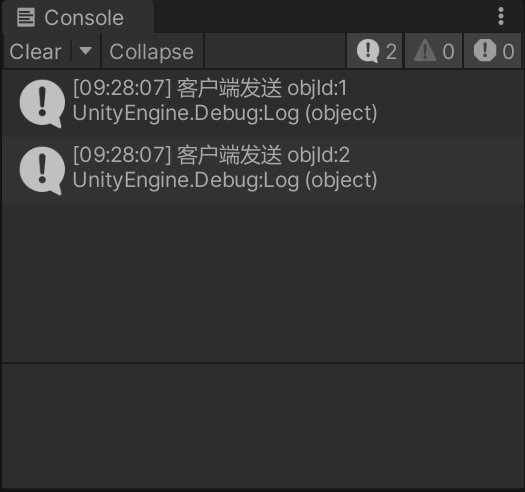 


 **需要拥有者所有权 [ServerRpc(RequireOwnership = true)]**

只有**当前端的所有者**能够发送信息（**Host端玩家1**、**Client端玩家2**可以发送）

Host端玩家1发送给Host端玩家1

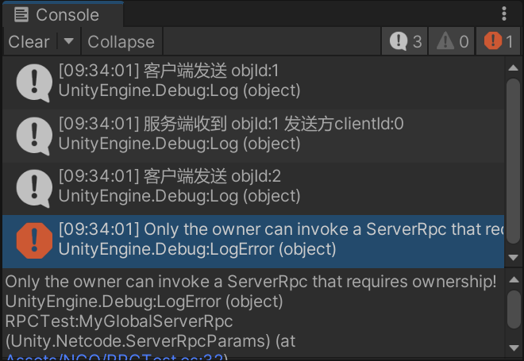 

Client端玩家2发送给Host端玩家2

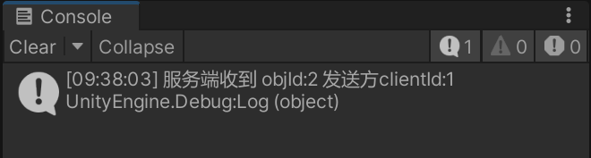 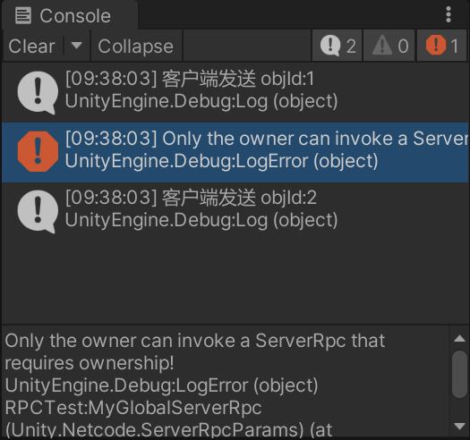 


### NetworkVariable

**自动同步到同一个NetworkObject在不同机上的克隆实例**，不需要像RPC那样要通过发信息然后手动更新值，玩家1在端1修改值，在端2的玩家1的值立刻同步

```csharp
public class NetworkVariableTest : NetworkBehaviour
{
    private NetworkVariable<int> Value = new NetworkVariable<int>(0);

    public override void OnNetworkSpawn()
    {
        base.OnNetworkSpawn();

        if (!IsServer)
        {
            Value.OnValueChanged += OnClientValueChanged;
        }
    }

    private void Update()
    {
        if (IsServer)
        {
            if (Input.GetMouseButtonDown(0))
            {
                Value.Value += 1;
                Debug.Log($"服务端 objId:{NetworkObjectId} Value:{Value.Value}");
            }
        }
    }

    private void OnClientValueChanged(int pre, int cur)
    {
        Debug.Log($"客户端Value改变 objId:{NetworkObjectId} pre:{pre} cur:{cur}");
    }
}
```

host端玩家n修改值，client端玩家n同步值

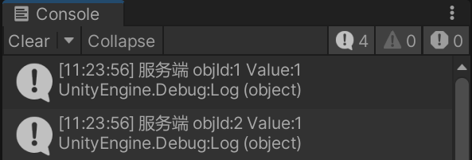  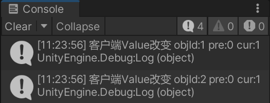 


反过来，Client端修改值，Host端同步，要指定NetworkVariableWritePermission.Owner和IsOwner，因为默认是NetworkVariableWritePermission.Server（Server端有写权限），改成Owner才能让Client端的Owner有写权限（Client端非Owener无法设置写权限）

```csharp
public class NetworkVariableTest : NetworkBehaviour
{
    private NetworkVariable<int> Value = new NetworkVariable<int>(0, NetworkVariableReadPermission.Everyone, NetworkVariableWritePermission.Owner);

    public override void OnNetworkSpawn()
    {
        base.OnNetworkSpawn();

        if (IsServer)
        {
            Value.OnValueChanged += OnServerValueChanged;
        }
    }

    private void Update()
    {
        if (!IsServer && IsOwner)
        {
            if (Input.GetMouseButtonDown(0))
            {
                Value.Value += 1;
                Debug.Log($"客户端 objId:{NetworkObjectId} Value:{Value.Value}");
            }
        }
    }

    private void OnServerValueChanged(int pre, int cur)
    {
        Debug.Log($"服务端Value改变 objId:{NetworkObjectId} pre:{pre} cur:{cur}");
    }
}
```

只有Client端的玩家2能够修改值，Host端玩家2同步值

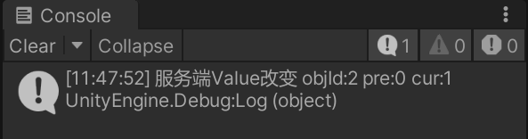 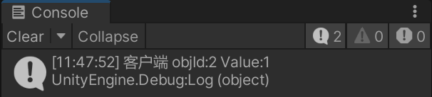 

如果没设置NetworkVariableWritePermission.Owner，Client端两玩家修改会报错

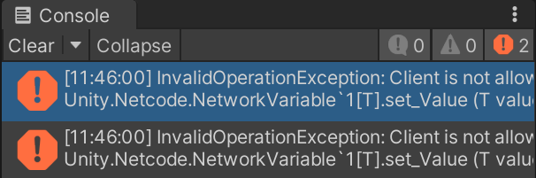 

设置了NetworkVariableWritePermission.Owner，但没限制IsOwner，Client端玩家1修改会报错

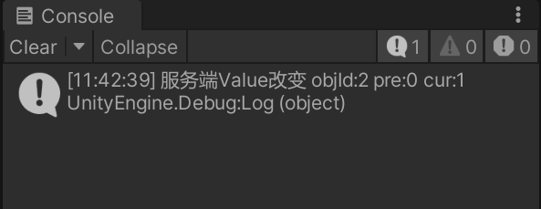 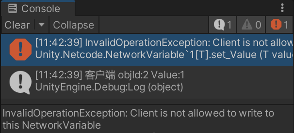 

