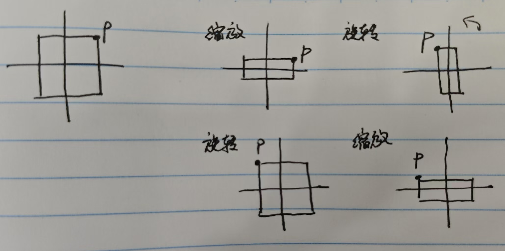
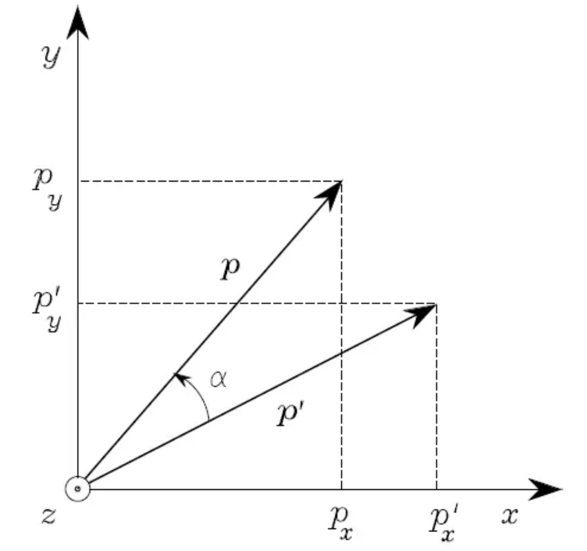
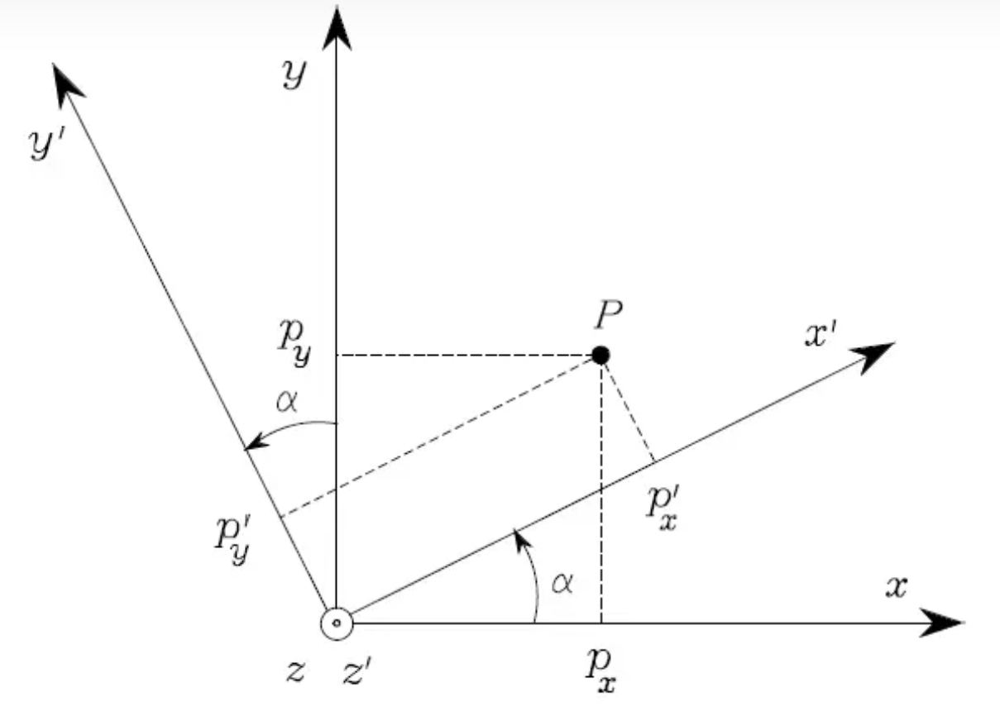
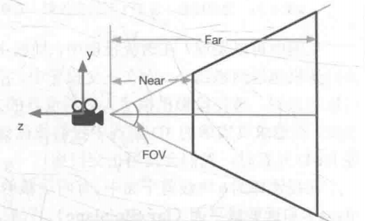
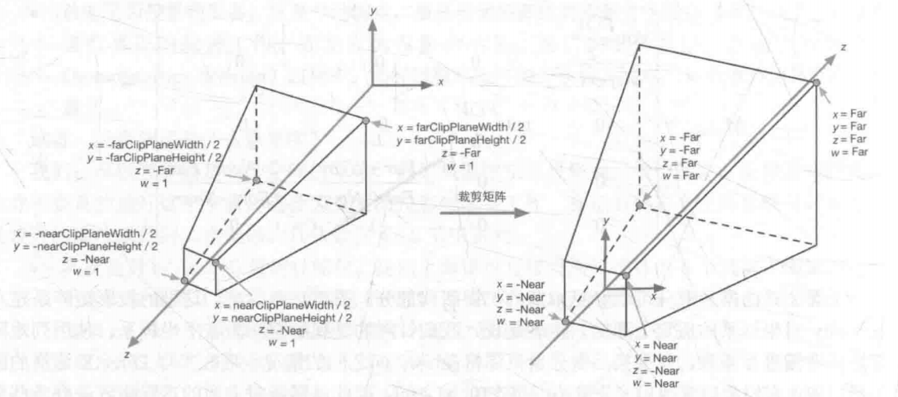
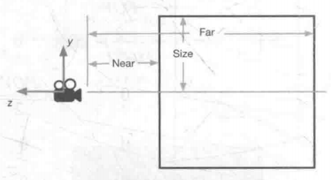
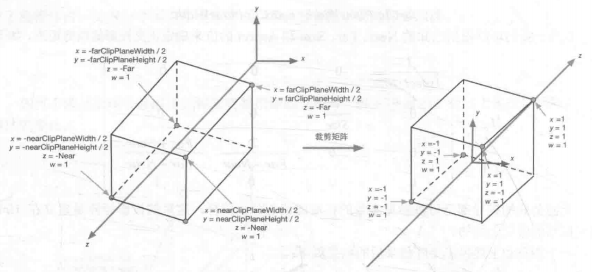
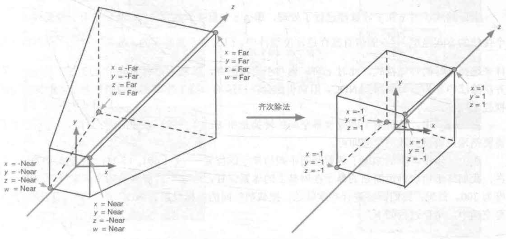
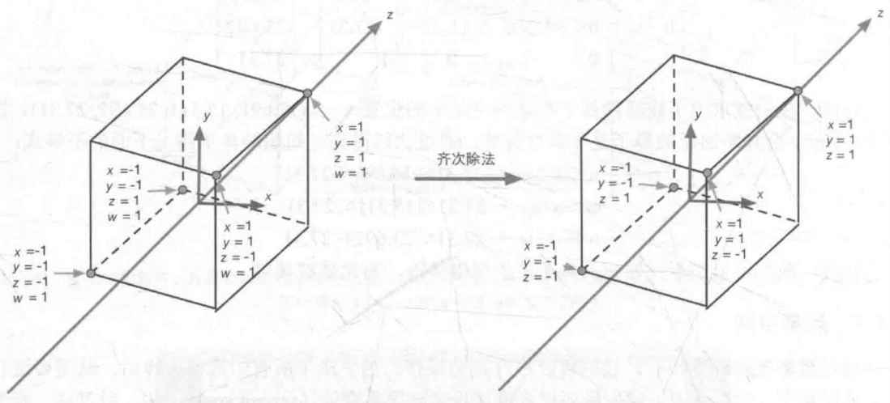
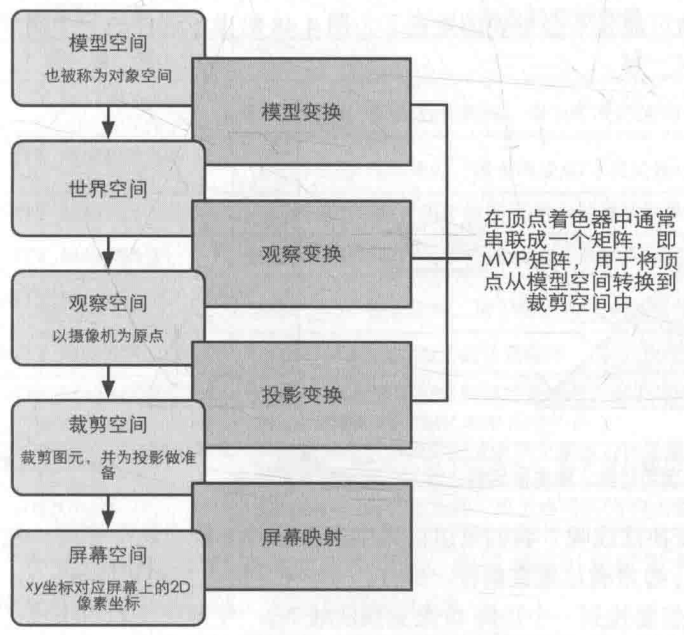

# 坐标转换


Canvas 

Render Mode

Screen Space - Overlay

画布大小就是屏幕分辨率

Screen Space - Camera

画布大小就是屏幕分辨率

World Space

画布大小是自定义的Width和Height


UI Scale Mode

Constant Pixel Scale：无论屏幕分辨率如何，UI 元素都保持相同的像素尺寸

开始分辨率(1920x1080)，UI在(960, 540)画布右上角，后来分辨率(1366x768)，UI仍然在(960, 540)，要移到画布右上角则移到(683, 384)

Scale With Screen Size：UI尺度根据屏幕分辨率缩放

分辨率(1920x1080)，UI坐标以画布中心为原点，右上角为(960, 540)


世界->屏幕

世界物体对应到屏幕的点

```csharp
Vector2 screenPoint = Camera.main.WorldToScreenPoint(worldPoint)
```

屏幕->世界

法1：屏幕射线检测

屏幕坐标z轴可为任意值不会有影响，射线构建只使用xy轴

```csharp
Ray ray = Camera.main.ScreenPointToRay(screenPoint);
if (Physics.Raycast(ray, out RaycastHit hitInfo))
{
    Vector3 worldPoint = hitInfo.point;
}
```

法2：屏幕坐标转换到世界中相对相机z距离对应的面

z距离是相对相机的z轴长度（planeZ为正，转换到相机前面的某个面）

```csharp
Vector3 worldPoint = Camera.main.ScreenToWorldPoint(new Vector3(screenPoint.x, screenPoint.y, planeZ));
```

UI世界->屏幕

UI的世界坐标转屏幕

Canvas Render Mode 为Overlay，则uiCamera为null，其余两种为对应的Camera

UI的世界坐标z轴可为任意值，算得的屏幕坐标z轴都是0

```csharp
Vector2 screenPoint = RectTransformUtility.WorldToScreenPoint(uiCamera, uiTransform.position);
```

为Overlay时，UI的世界坐标等于屏幕坐标（xy轴相等，z轴可清零）

```csharp
Vector2 screenPoint = uiTransform.position;
```

屏幕->UI世界

rectTransform据实验是可以任意的rect，一般使用移动目标的rect或目标的parent的rect

```csharp
RectTransformUtility.ScreenPointToWorldPointInRectangle(rectTransform, screenPoint, uiCamera, out var worldPoint);
uiTransform.position = worldPoint;
```


另外的

屏幕->UI本地

rectTransform为父物体的rect

```csharp
RectTransformUtility.ScreenPointToLocalPointInRectangle(parentRect, screen, uiCamera, out var localPoint);
uiTransform.localPosition = localPoint;
```


# 欧拉角与四元数

每次输入的xyz旋转值都是都是从000开始直接输出旋转结果的过程

开始输入10 90 0 这时看到z轴在之前x轴位置，然后去把x调到20，想绕着目前的x轴旋转，实际上看依然是现在的z轴旋转，因为第二次调x不是相对于10 90 0 的状态给x加10，而是从000开始计算20 90 0的结果是什么，都是相对于最开始的轴旋转的，这就是动态欧拉角的计算方法

变换的顺序是预先确定的顺序而非实际输入的顺序。（并不会因为我们每次输入一次，欧拉角计算参考的坐标系同步为我们改完后的坐标系）
**欧拉角是用固定顺序对初始坐标系进行变换**


个人感觉：就是说，Unity中直接按角度旋转，是用欧拉角描述的，在代码中想要使物体沿自身坐标轴旋转，用欧拉角都是按照初始状态计算的（既然依次设定每个轴的旋转都是按照最开始的轴，也就是按模型初始坐标轴旋转嘛，并不是真正的“相对”，还是一个固定不变的轴，就跟按世界坐标旋转似的），所以欧拉角不适合用来运用到相对自身转动，这时用**四元数**描述**自身旋转**最合适


**检视面板上的Rotation的值是相对于父物体的旋转角度，而不是相对于自身坐标轴的旋转角度（即（30，40，50）并不是自身相对初始坐标轴的xyz各旋转了30 40 50）**

如果父物体有初始旋转角度，在scene中用旋转工具按某个轴旋转物体，本物体的Rotation三个值都会改变，因为这个值是相对于父物体的角度值

而相对自身坐标轴的旋转角度其实无法直接获得，因为transform.localRotation.eulerAngles这个欧拉角是根据当前物体的旋转四元数转换过来的值，并不是相对开始旋转的xyz值


transform.rotation = 和 *= Quaternion.Euler(0, 10, 0)的区别：

=四元数：无视初始角度，<u>从世界角度为0的状态</u>，物体按初始y轴（就是世界y轴）旋转10度

*=四元数：即transform.rotation = transform.rotation * Quaternion.AngleAxis(10, Vector3.up)，先将物体<u>从世界角度为0的状态</u>，旋转rotation值，再以旋转后的自身坐标轴的y轴旋转10度

使用四元数的时候，第一个四元数旋转是按0开始的旋转，后面叠加的四元数旋转是按前面旋转后的自身轴向来旋转


四元数左乘三维向量，将该向量按照四元数表示的角度旋转

```csharp
Vector3 point = new Vector3(0,0,10);
Vector3 newPoint = Quaternion1 * point;
```

多个四元数相乘，组合旋转效果，顺序有关，先进行旋转1，再进行旋转2

```csharp
Quaternion qt1 = Quaternion1 * Quaternion2;
```


Unity API

transform.rotation = Quaternion.LookRotation(dir)

look只会旋转本地xy轴，z轴不会旋转


# 矩阵

## 齐次坐标

点：
$$
\left[
\matrix{
  x\\
  y\\
  z\\
  1
}
\right]
$$
方向矢量：
$$
\left[
\matrix{
  x\\
  y\\
  z\\
  0
}
\right]
$$

## 变换

左右手坐标系矩阵的区别是互为转置矩阵

### 平移矩阵

$$
M_{translation}=\left[
\matrix{
  1 & 0 & 0 & t_x\\
  0 & 1 & 0 & t_y\\
  0 & 0 & 1 & t_z\\
  0 & 0 & 0 & 1
}
\right]
$$

### 缩放矩阵

$$
M_{scale}=\left[
\matrix{
  k_x & 0 & 0 & 0\\
  0 & k_y & 0 & 0\\
  0 & 0 & k_z & 0\\
  0 & 0 & 0 & 1
}
\right]
$$

### 旋转矩阵

以下适用于左手坐标系，绕顺时针旋转值为正（或右手坐标系，绕逆时针旋转）

（如果是左手绕逆，或右手绕顺，那每个矩阵的sin取反（即转置矩阵））

为正交矩阵，其逆矩阵=转置矩阵
$$
R_x(\Theta)=\left[
\matrix{
  1 & 0 & 0 & 0\\
  0 & cos\Theta & -sin\Theta & 0\\
  0 & sin\Theta & cos\Theta & 0\\
  0 & 0 & 0 & 1
}
\right]
$$

$$
R_y(\Theta)=\left[
\matrix{
  cos\Theta & 0 & sin\Theta & 0\\
  0 & 1 & 0 & 0\\
  -sin\Theta & 1 & cos\Theta & 0\\
  0 & 0 & 0 & 1
}
\right]
$$

$$
R_z(\Theta)=\left[
\matrix{
  cos\Theta & -sin\Theta & 0 & 0\\
  sin\Theta & cos\Theta & 0 & 0\\
  0 & 0 & 1 & 0\\
  0 & 0 & 0 & 1
}
\right]
$$

### 复合变换

$$
P_{new}=M_{translation}M_{rotation}M_{scale}P_{old}
$$

一定要先缩放后旋转的原因：因为复合变换是基于世界坐标系的，对一个原点不在世界坐标0的物体也要先平移到世界0，再进行复合变换，再平移回去

[矩阵变换先缩放、后旋转、再平移的原因](https://zhuanlan.zhihu.com/p/672975444#:~:text=%E8%AE%BE%E5%B9%B3%E9%9D%A2%E5%AD%98%E5%9C%A8%E5%90%91%E9%87%8Fa%20%282%2C1%29%2C%E9%80%86%E6%97%B6%E9%92%88%E6%97%8B%E8%BD%AC90%C2%B0%EF%BC%8C%E5%86%8D%E5%AF%B9%E5%9F%BA%E5%90%91%E9%87%8Fj%E7%BC%A9%E6%94%BE0.5%E5%80%8D%2C%E5%81%87%E5%A6%82%E5%85%88%E6%97%8B%E8%BD%AC%E7%9A%84%E8%AF%9D%EF%BC%8C%E6%9C%80%E7%BB%88%E5%BE%97%E5%88%B0a%27%27%EF%BC%8C%E5%A6%82%E5%9B%BE%E6%89%80%E7%A4%BA%E3%80%82,%E7%9F%A9%E9%98%B5%E5%8F%98%E6%8D%A2%E5%A6%82%E4%B8%8B%EF%BC%9A%20%E5%A6%82%E6%9E%9C%E5%85%88%E6%97%8B%E8%BD%AC%E5%86%8D%E7%BC%A9%E6%94%BE%EF%BC%8C%E5%8F%97%E7%BC%A9%E6%94%BE%E7%9A%84%E5%BD%B1%E5%93%8D%EF%BC%8C%E5%AF%BC%E8%87%B4%E4%B8%8A%E4%B8%80%E6%AD%A5%E7%9A%84%E6%97%8B%E8%BD%AC%E8%A7%92%E5%BA%A6%E5%8F%91%E7%94%9F%E6%94%B9%E5%8F%98%E3%80%82%20%E5%9B%A0%E4%B8%BA%E7%89%A9%E4%BD%93%E7%BB%8F%E8%BF%87%E6%97%8B%E8%BD%AC%E5%90%8E%EF%BC%8C%E7%89%A9%E4%BD%93%E7%9A%84%E5%9F%BA%E5%90%91%E9%87%8F%E4%B8%8E%E5%8E%9F%E5%9D%90%E6%A0%87%E7%9A%84%E5%9F%BA%E5%90%91%E9%87%8F%E4%B8%8D%E4%B8%80%E8%87%B4%EF%BC%8C%E8%80%8C%E7%BC%A9%E6%94%BE%E4%BB%8D%E7%84%B6%E6%98%AF%E6%8C%89%E5%8E%9F%E5%9D%90%E6%A0%87%E7%9A%84%E5%9F%BA%E5%90%91%E9%87%8F%E8%BF%9B%E8%A1%8C%E7%BC%A9%E6%94%BE%E7%9A%84%EF%BC%88%E4%B8%8E%E4%B8%BA%E4%BB%80%E4%B9%88%E4%B8%8D%E8%83%BD%E5%85%88%E5%B9%B3%E7%A7%BB%E7%9A%84%E5%8E%9F%E5%9B%A0%E7%B1%BB%E4%BC%BC%EF%BC%89%EF%BC%8C%E8%BF%99%E6%A0%B7%E5%B0%B1%E4%BC%9A%E5%BD%B1%E5%93%8D%E5%88%B0%E4%B8%8A%E4%B8%80%E6%AD%A5%E7%9A%84%E6%97%8B%E8%BD%AC%E8%A7%92%E5%BA%A6%E3%80%82)



上图是对物体缩放（1,0.5）和逆时针旋转90°，可见，通常对一个物体进行复合变换时，我们认为缩放和旋转都是基于对物体的本地坐标进行缩放和旋转（也就是基于世界坐标系），矩阵中先旋转后缩放，旋转时物体的本地坐标朝向变了，但这时缩放是基于世界坐标的而不是我们认为的本地坐标（这时还是对物体进行世界坐标的（1,0.5）缩放，但其实它旋转后我们应该是希望它按世界坐标的（0.5,1）缩放）

（题外话，复合矩阵运算中，每次乘旋转矩阵都是以之前变换后的最新本地坐标来旋转的而不是按照本地坐标（比如先绕y旋转90，再绕z旋转90，后面的绕z旋转是绕y旋转后的本地z轴），因为旋转依赖本地轴向，上面先缩放后，轴向没有变，所以就不会影响旋转）


### 更复杂的变换

[图形学中的基本变换（缩放、平移、旋转、剪切、镜像）](https://blog.csdn.net/qw8704149/article/details/118856088)


## 旋转矩阵2个用途

旋转矩阵用途：旋转向量、坐标变换

### 向量旋转



P'点旋转α，得到P点，旋转矩阵是R，则：

P=R*P'

### 坐标变换



坐标系O-xyz到坐标系O-x'y'z'的旋转矩阵是R，在新坐标系下P点坐标变为P'，则：

P=R*P'

## 旋转顺序

旋转(θx, θy, θz)时，需注意旋转顺序

Unity中指定旋转(θx, θy, θz)时旋转顺序是zxy，组合变换矩阵是Mz·Mx·My，是按旋转三个角度前的最初坐标轴旋转的（绕最初z轴，最初x轴，最初y轴依次旋转）

而组合变换矩阵Mz·Mx·My，同时是绕最初坐标系y轴旋转θy，再绕旋转θy后的新坐标系x轴旋转θx，再绕旋转θx后的新坐标系z轴旋转θz

即 绕最开始轴 和 绕变换后的轴 的组合旋转矩阵是相反的

## 观察空间

世界空间->观察空间（左手转右手坐标）

世界->相机本地空间的变换矩阵 为 移动相机使相机坐标轴与世界坐标轴重合，由于观察空间为右手系（相机前方是z轴负方向），所以最后需将z分量取反
$$
M_{wisw}=\left[
\matrix{
  1 & 0 & 0 & 0\\
  0 & 1 & 0 & 0\\
  0 & 0 & -1 & 0\\
  0 & 0 & 0 & 1
}
\right]M_{rotation}M_{translation}
$$
相机相对世界的平移是(10, 0, 0)，旋转是(30, 0, 0)，移动相机使相机坐标轴与世界坐标轴重合则是：先平移(-10, 0, 0)，再旋转(-30, 0, 0)。最后z分量取反变换为右手系

## 裁剪空间

裁剪矩阵：观察空间->裁剪空间（右手转左手坐标）

### 透视投影

$$
P_{clip}=\left[
\matrix{
  \frac{cot{\frac{FOV}{2}}}{Aspect} & 0 & 0 & 0\\
  0 & cot{\frac{FOV}{2}} & 0 & 0\\
  0 & 0 & \frac{Far+Near}{Far-Near} & -\frac{2\cdot{Near}\cdot{Far}}{Far-Near}\\
  0 & 0 & -1 & 0
}
\right]\left[
\matrix{
  x\\
  y\\
  z\\
  1
}
\right]
$$
乘透视投影矩阵后，每个点的w变为-z，不满足 -w <= x y z <= w 的都要被剔除

（为了后面透视除法（xyz除以w）后xyz都在[-1, 1]内，而w=-z，也就是每个点的xy取值应该就是[-z, z]内，例如远平面的每个点在[-Far, Far]，因为远平面的z=-Far）

已知：
$$
Aspect=\frac{W_{Near}}{H_{Near}}=\frac{W_{Far}}{H_{Far}}
$$

$$
H=2*W*tan{\frac{FOV}{2}}
$$

推导：

**1. X方向**

近平面观察空间中（举例）：
$$
-\frac{W_N}{2}\leq{x}\leq\frac{W_N}{2}
$$

$$
-\frac{Aspect\cdot{H_N}}{2}\leq{x}\leq\frac{Aspect\cdot{H_N}}{2}
$$

要缩放到：
$$
-Near\leq{x}\leq{Near}
$$
缩放倍数为：

$$
S_x=\frac{Near}{\frac{Aspect\cdot{H_N}}{2}}=\frac{Near}{Aspect\cdot{Near}\cdot{tan{\frac{FOV}{2}}}}=\frac{cot{\frac{FOV}{2}}}{Aspect}
$$
**2. Y方向**

近平面观察空间中（举例）：
$$
-\frac{H_N}{2}\leq{y}\leq\frac{H_N}{2}
$$

要缩放到：
$$
-Near\leq{y}\leq{Near}
$$
缩放倍数为：

$$
S_y=\frac{Near}{\frac{H_N}{2}}=\frac{Near}{Near\cdot{tan{\frac{FOV}{2}}}}=cot{\frac{FOV}{2}}
$$
**3. Z方向**

视椎内：
$$
-Near\leq{z}\leq{-Far}
$$
要变换到：
$$
-Near\leq{z}\leq{Far}
$$
这是缩放+平移，变换矩阵要求先缩放后平移

缩放：
$$
区间范围:Near-Far \rightarrow Far+Near
$$

$$
S_z=\frac{Far+Near}{Near-Far}
$$

在缩放后的平移：
$$
-Near\cdot S_z (缩放后的近点坐标) \rightarrow -Near(最终近点坐标)
$$

$$
T_Z=-Near+Near\cdot S_z=Near\cdot(S_z-1)=-\frac{2\cdot Near \cdot Far}{Far-Near}
$$





### 正交投影

$$
P_{clip}=\left[
\matrix{
  \frac{1}{Aspect \cdot Size} & 0 & 0 & 0\\
  0 & \frac{1}{Size} & 0 & 0\\
  0 & 0 & -\frac{1}{Far-Near} & -\frac{Far+Near}{Far-Near}\\
  0 & 0 & 0 & 1
}
\right]\left[
\matrix{
  x\\
  y\\
  z\\
  1
}
\right]
$$

透视投影矩阵将w变为1，不满足 -w <= x y z <= w 的都要被剔除

已知：
$$
Aspect=\frac{W}{2 \cdot Size}
$$

推导：

XY方向都是求缩放倍数，Z方向是先缩放后平移，推导过程与透视投影相似





## 屏幕空间

### 齐次除法（透视除法）

用w分量除xyz分量，得到NDC（归一化的设备坐标），xyz的范围是[-1, 1]

透视：裁剪空间中 -w <= x y z <= w，除以w后 -1 <= x y z <= 1



正交：已经是 -1 <= x y z <= 1（正交投影后的坐标在齐次除法阶段没有变化，因为在正交投影步骤已经得到了NDC坐标）



### 齐次除法+屏幕映射

$$
screen_x=(\frac{clip_x}{clip_w \cdot 2} + \frac{1}{2}) \cdot pixelWidth
$$

$$
screen_y=(\frac{clip_y}{clip_w \cdot 2} + \frac{1}{2}) \cdot pixelHeight
$$

z分量会用于深度缓存，有的驱动会存clipz/clipw，但不是必须的

## MVP

模型到屏幕空间转换：

模型空间–>世界空间–>观察空间–>剪裁空间–>屏幕空间

通常MVP转换在顶点着色器进行，而裁剪空间->屏幕空间的转换由Unity内部进行，在片元着色器中可得到片元在屏幕空间的位置



# Shader

## 混合模式

最终颜色（rgba） = （着色器输出颜色 * 源系数）+（缓冲区颜色 * 目标系数）

Blend SrcFactor DstFactor ：SrcFactor是源系数，DstFactor是目标系数，源是着色器输出颜色，目标是颜色缓冲颜色

各种实例：https://aver58.github.io/2019/07/20/ShaderLab_Blending/

Blend zero one：仅显示背景的RGB部分，无Alpha透明通道处理。

Blend one  zero：  仅显示贴图的RGB部分，无Alpha透明通道处理。 A通道为0即本应该透明的地方也渲染出来了。

Blend one  one：贴图和背景叠加，无Alpha透明通道处理。仅仅是颜色rgb数值的叠加更趋近于白色即（1，1，1）了。

Blend SrcAlpha  zero：仅仅显示贴图，贴图含Alpha透明通道处理。但是贴图中的透明部分，即下图黑色部分没有颜色来显示，因为源颜色乘以alpha值0，为0；而混合目标的颜色乘以zero 0，也是0。所以透明部分显示的颜色为（0，0，0）

（虽然颜色缓冲中也有a，但我实际发现颜色缓冲的a对实际显示的rgb颜色有影响，但不是直接等于原rgb*a，平时使用时可认为a=1，因为总要渲染背景，天空盒等不透明物体，或者说平常对待透明物体只需关心rgb的计算，a值仅作为SrcAlpha这样的混合因子用于混合rgb）

**AB（Alpha Blend）**

_Src=SrcAlpha _Dst=OneMinusSrcAlpha _AlphaAdd=0

rgb值无需乘透明度，即保持原本颜色，但应用透明度

**AD（Alpha Additive）**

_Src=One _Dst=One _AlphaAdd=1

rgb值需乘透明度，即在原本颜色基础上，透明度越高的地方越亮

（Blend One One模式下，当rbg值不乘透明度时，透明区域也变成白色，因为透明部分rgb=(1, 1, 1)，最终rgb=(1, 1, 1)*1+背景rgb\*1=(1, 1, 1)），所以显示白色）


以上分别为AB AD

```
Properties
{
    [Enum(UnityEngine.Rendering.BlendMode)]
    _Src("Src", int) = 0
    [Enum(UnityEngine.Rendering.BlendMode)]
    _Dst("Dst", int) = 0
    [Toggle]_AlphaAdd("AlphaAdd", int) = 0
    _MainTex ("Texture", 2D) = "white" {}
}
SubShader
{
    Tags { "Queue" = "Transparent" "RenderType" = "Transparent" }
    Blend [_Src] [_Dst]
    ZWrite Off
    LOD 100

    Pass
    {
        CGPROGRAM
        #pragma vertex vert
        #pragma fragment frag

        #include "UnityCG.cginc"

        struct appdata
        {
            float4 vertex : POSITION;
            float2 uv : TEXCOORD0;
        };

        struct v2f
        {
            float2 uv : TEXCOORD0;
            float4 vertex : SV_POSITION;
        };

        sampler2D _MainTex;
        float4 _MainTex_ST;
        uniform int _Scr;
        uniform int _Dst;
        uniform float _AlphaAdd;

        v2f vert (appdata v)
        {
            v2f o;
            o.vertex = UnityObjectToClipPos(v.vertex);
            o.uv = TRANSFORM_TEX(v.uv, _MainTex);
            return o;
        }

        fixed4 frag (v2f i) : SV_Target
        {
            fixed4 texCol = tex2D(_MainTex, i.uv);
            fixed3 col = (_AlphaAdd == 0 ? texCol.rgb : texCol.rgb * texCol.a);
            fixed alpha = texCol.a;
            return fixed4(col.rgb, alpha);
        }
        ENDCG
    }
}
```

